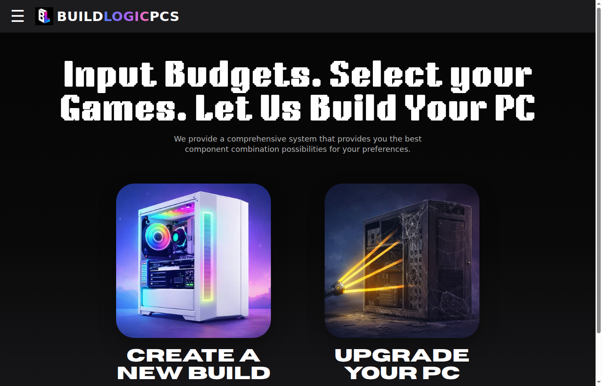
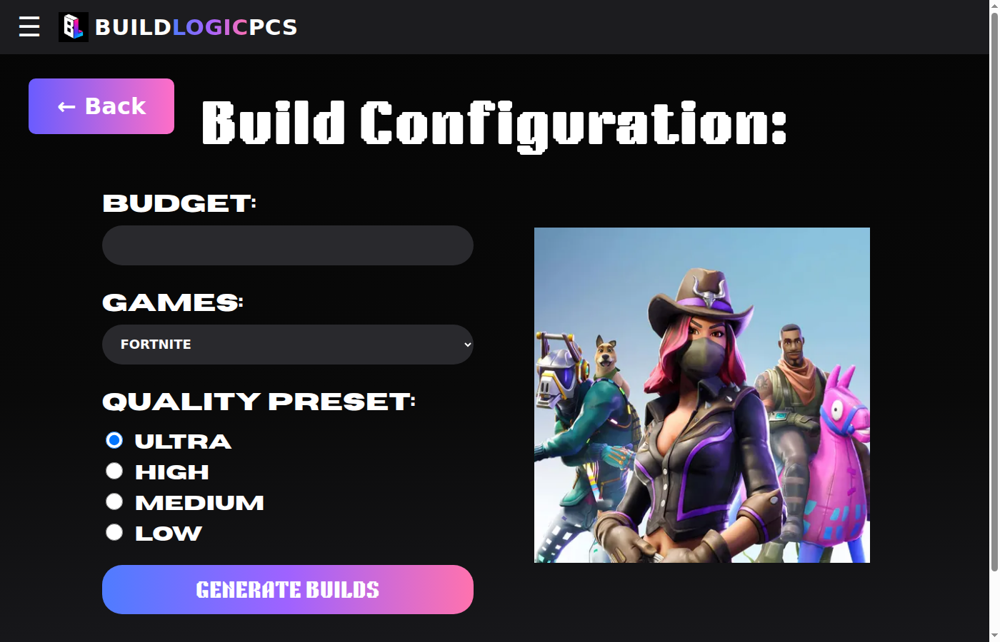
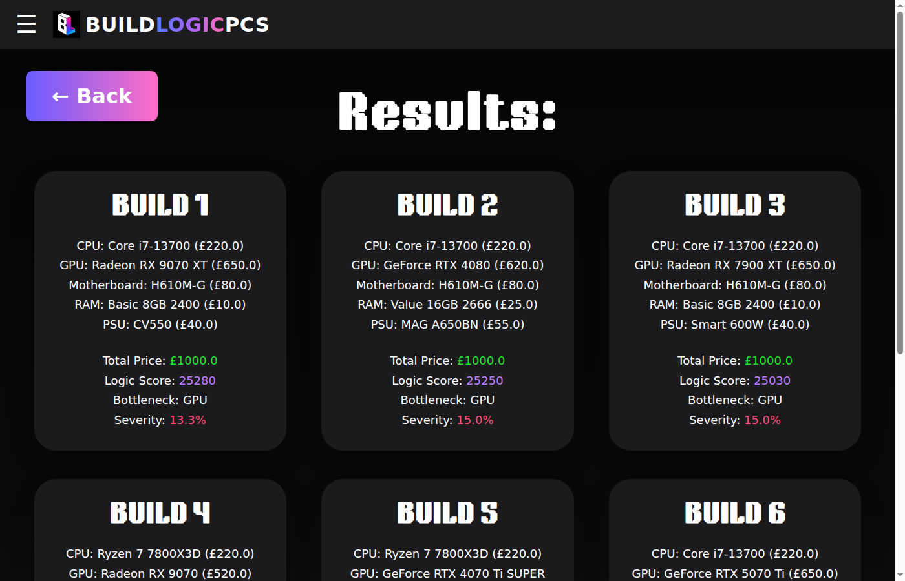
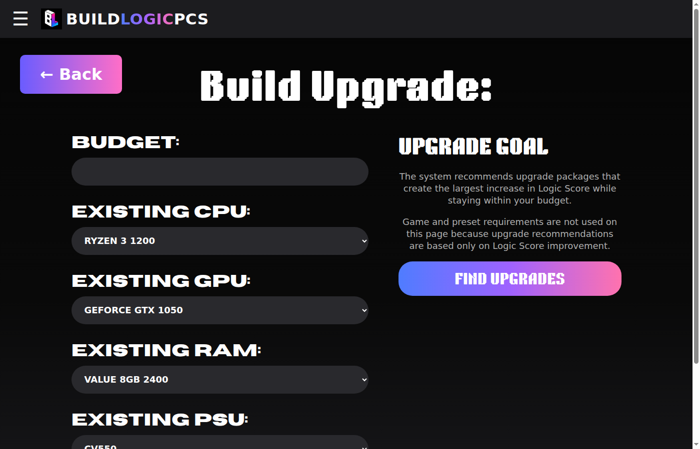

# PC Build Optimiser

A web app that helps you pick compatible PC parts for gaming — choose a budget, pick the games you want to play, and it'll suggest the best builds for the money. Also handles upgrades for existing PCs.

Built as an A-Level Computer Science NEA project (OCR), originally under the name **BuildLogicPCS**.

---

## What it does

- **New Build** — tell it your budget, select a game and quality preset (Ultra/High/Medium/Low), and it generates up to 6 complete PC builds ranked by performance. Each build shows component breakdown, total price, logic score (its performance metric), and any CPU/GPU bottleneck.
- **Upgrade** — if you already have a PC, pick your existing components and a budget. It'll find the best upgrades (CPU, GPU, RAM, or combo) that fit the budget and give the biggest performance lift.
- **Compare** — pick two builds side-by-side and see component differences, price, scores, and bottlenecks.
- **Case Designer** — after picking a build, choose a case that fits the hardware, with a live preview and price update.
- **Purchase Links** — every component gets a static Google Shopping search link so you can check current prices.

Everything is checked for compatibility automatically — CPU socket matching, RAM generation, PSU wattage, PCIe version. No manuals needed.

---

## Tech Stack

| Thing | What |
|---|---|
| Backend | Python + Flask (3.1) |
| Database | SQLite (embedded, ~9MB of component data) |
| Frontend | HTML + CSS + vanilla JS |
| Scoring | Weighted logic score (CPU 40%, GPU 50%, RAM 10%) + game-requirement matching |

The component database ships pre-loaded with 98 CPUs, 98 GPUs, 50 RAM sticks, 20 motherboards, 20 PSUs, 29 cases, and 15 games with 4 quality presets each. All performance scores are stored from real benchmarks.

---

## Screenshots

| Homepage | New Build Config | Results | Upgrade |
|---|---|---|---|
|  |  |  |  |

---

## How to run it

```bash
# Clone
git clone https://github.com/TheAhmadZeb/pc-builder-optimiser.git
cd pc-builder-optimiser

# Install Flask
pip install flask

# Run
python3 app.py
```

Open http://localhost:5000. The database builds itself on first run from the SQL files in `sql/`.

---

## Project structure

```
pc-builder-optimiser/
├── app.py                     # Flask routes
├── backend/
│   ├── db.py                  # SQLite connection & queries
│   ├── compatibility.py       # CPU/RAM/PSU/PCIe compatibility checks
│   ├── scoring.py             # Logic score, bottleneck, game performance
│   ├── optimisation.py        # Build generator + upgrade recommender
│   └── comparison.py          # Side-by-side build comparison
├── sql/
│   ├── schema.sql             # Database schema
│   └── seed.sql               # Pre-loaded component & game data
├── static/
│   ├── css/style.css
│   ├── js/app.js
│   ├── fonts/                 # Custom fonts
│   └── assets/                # Images, game posters, case previews
├── templates/                 # Jinja2 templates
└── screenshots/               # App screenshots
```

---

## Key algorithms

- **Compatibility checking** — socket matching, RAM type, PSU wattage, PCIe version
- **Game performance estimation** — checks CPU/GPU scores against stored game requirements with dynamic weighting based on whether each game is CPU-heavy or GPU-heavy
- **Logic score** — weighted combination of CPU (40%), GPU (50%), RAM (10%) performance scores with a geometric mean penalty for unbalanced builds
- **Build optimisation** — iterates through component combinations within budget, picks the top 6 by logic score
- **Bottleneck detection** — compares CPU vs GPU performance to identify the limiting component and estimate severity
- **Upgrade recommendation** — evaluates all CPU, GPU, RAM upgrade paths within budget, returns the best options

---

## What it doesn't do

- No live pricing — prices are static snapshots. Useful for comparison, not up-to-the-minute shopping.
- No real FPS benchmarks — bottleneck percentages and performance scores are estimates based on stored data, not real-time game tests.
- No user accounts or saved builds — everything lives in the browser session.

These were deliberate trade-offs to keep the project self-contained and testable.

---

## License

MIT — use it, break it, improve it.
